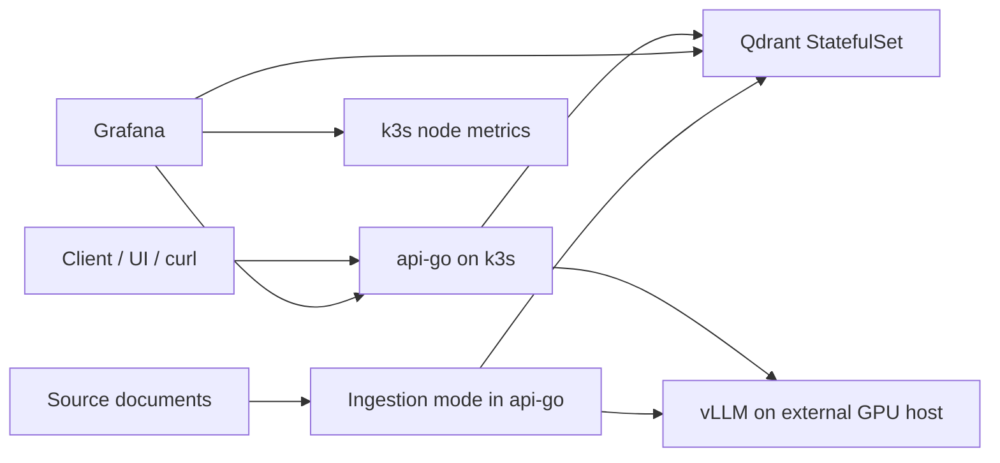

# Architecture Overview

## Purpose

This document describes the baseline architecture of the retrieval platform used in the pet project. It is intentionally small, opinionated, and easy to reason about. The goal is not to mimic a hyperscale production stack, but to show clear engineering decisions, operational boundaries, and failure modes.

## Scope

This document mixes the current implemented platform state with the near-term target design. Today the project already runs k3s, api-go, Qdrant, and Grafana. The external GPU host and full vLLM-backed ingestion and answer generation path are part of the target design that the platform is being built toward.

The platform is built from the following main components:

- **k3s** — lightweight Kubernetes control plane and runtime for the main application services
- **api-go** — Go API that serves search/retrieval requests and drives ingestion workflows
- **Qdrant** — vector database used to store embeddings, chunk payloads, and metadata
- **Grafana** — dashboards for API, Qdrant, and infrastructure health
- **GPU host** — external machine with a GPU, outside of k3s
- **vLLM** — model server running on the external GPU host, used for embeddings and optional answer generation

## Architecture at a glance

## High-level request flow

### Retrieval path

1. A client sends a query to `api-go`.
2. `api-go` validates the request and generates an embedding for the query by calling the external `vLLM` endpoint.
3. `api-go` sends the resulting vector to Qdrant.
4. Qdrant returns the top matching chunks and their payloads.
5. `api-go` returns either:
   - retrieved chunks directly, or
   - an answer synthesized with help from `vLLM`, using the retrieved chunks as context.

### Ingestion path

1. Documents are uploaded or loaded by an ingestion command implemented in the `api-go` codebase.
2. The ingester extracts text and splits it into chunks.
3. For each chunk, `api-go` calls `vLLM` to generate embeddings.
4. `api-go` upserts the chunk, embedding, and metadata into a Qdrant collection.

## Component responsibilities

## k3s

k3s hosts the core control-plane for the project and schedules the application workloads. In this project, k3s is intentionally used for lightweight orchestration rather than for every single dependency.

What runs in k3s:

- `api-go` deployment
- `Qdrant` stateful workload
- `Grafana`
- optional config maps, secrets, services, ingress

Why k3s:

- simple operational footprint
- easy local-to-server parity
- enough orchestration for a small platform without the weight of a larger Kubernetes distribution

## api-go

`api-go` is the main control surface of the platform.

Responsibilities:

- expose retrieval/search API
- run readiness and health endpoints
- coordinate calls to Qdrant
- coordinate calls to `vLLM`
- run ingestion logic in a dedicated command or mode
- expose application metrics

`api-go` is **stateless**. It does not persist durable data locally. Any pod can be replaced as long as configuration and secrets remain available.

## Qdrant

Qdrant stores the retrieval index.

Stored in Qdrant:

- chunk embeddings
- chunk text payload
- document metadata such as source, section, and chunk ID
- collection configuration and index structures

Qdrant is **stateful** and depends on a persistent volume. This is the most important durable data layer in the baseline platform.

## Grafana

Grafana is the operator-facing visibility layer.

Used for:

- API latency dashboards
- ingestion success/failure tracking
- Qdrant health and collection size visibility
- infrastructure checks such as pod restarts and node pressure

Grafana is useful operationally, but it is not part of the serving data path. If Grafana is down, user queries can still succeed.

## GPU host

The GPU host is a separate machine outside of k3s. It exists to isolate GPU scheduling, driver management, and model-serving lifecycle from the main cluster.

Responsibilities:

- run the `vLLM` process or container
- expose embedding and generation endpoints
- manage GPU memory, model load, and restart behavior

This host is a major dependency for ingestion and for any retrieval flow that computes embeddings at request time.

## vLLM

vLLM is the model-serving layer used behind an OpenAI-compatible HTTP interface.

Used for:

- query embeddings
- chunk embeddings during ingestion
- optional final answer generation from retrieved context

It is treated as an **external dependency** from the perspective of k3s.

## Traffic flows and trust boundaries

### Internal k3s traffic

Within the cluster:

- `api-go` talks to Qdrant over the internal service network
- Grafana scrapes or visualizes metrics from cluster-exposed endpoints

This path is expected to be low-latency and stable.

### Cross-boundary traffic to GPU host

`api-go` reaches `vLLM` over the network to a separate machine.

This boundary matters because it introduces:

- extra latency
- DNS or IP dependency
- TLS or authentication configuration
- a separate lifecycle and reboot domain
- a separate scaling bottleneck

In practice, the most failure-prone path is often:

`api-go -> external GPU host -> vLLM`

## Stateful vs stateless map

### Stateful

- **Qdrant**
  - requires persistent storage
  - losing the PVC means losing indexed vectors and payloads unless backups exist

### Stateless

- **api-go**
  - can be rescheduled and replaced
- **Grafana**
  - in this baseline project Grafana is considered non-critical and can be recreated
- **vLLM process**
  - model server state is runtime state, not source-of-truth data
- **k3s worker pod scheduling**
  - application pods can be recreated from manifests and images

## Source of truth

The practical source of truth in this project is split across two places:

1. **Git repository**
   - manifests
   - API code
   - dashboards as code if exported
   - deployment procedures
2. **Qdrant persistent volume**
   - actual indexed knowledge data used by retrieval

This split is important: infrastructure can be recreated from Git, but retrieval data cannot be recovered from Git alone.

## Data model summary

The baseline retrieval schema stores one point per chunk in a Qdrant collection.

Typical payload fields:

- `doc_id`
- `source_path`
- `title`
- `section`
- `chunk_id`
- `chunk_text`
- `ingested_at`
- `embedding_model`

This design favors simplicity over minimal storage usage. Keeping chunk text in payload makes retrieval demos and debugging easier.

## Known single points of failure

This platform is intentionally simple, so several single points of failure exist.

### Single-node k3s control plane

If the only k3s node dies, the control plane and all in-cluster workloads are unavailable.

### Single Qdrant node

If Qdrant is running as a single-node StatefulSet, there is no replica to fail over to.

### Single Qdrant PVC

If the disk or PVC is corrupted and no snapshot exists, retrieval data is lost.

### Single external GPU host

If the GPU host is down, the platform loses embeddings generation and possibly final answer generation.

### Network dependency between k3s and GPU host

Even if both sides are healthy, a routing or firewall issue can break the embedding path.

### Manual deployment flow

If deployments are manual, the risk of config drift or bad tags is higher than with a fully automated pipeline.

## Failure mode examples

### Qdrant unavailable

Impact:

- retrieval requests fail or degrade
- ingestion cannot upsert vectors
- `/ready` should fail if Qdrant dependency is required for serving

### vLLM unavailable

Impact:

- new query embeddings cannot be generated
- ingestion stalls
- answer generation may fail
- depending on implementation, cached or already embedded flows may still partially work

### api-go crashloop

Impact:

- public API unavailable
- Qdrant data still intact
- recovery usually means fixing config or image and redeploying

### Grafana unavailable

Impact:

- no dashboards
- no direct user-facing impact
- incident diagnosis becomes slower

## Why vLLM is outside k3s

The model server is intentionally placed outside the cluster because GPU operations have a different cost and lifecycle profile than the core API stack.

Benefits of separation:

- no need to turn the entire k3s environment into a GPU-aware cluster
- simpler node management for the core platform
- easier experimentation with rented GPU capacity
- independent restarts and upgrades of model-serving layer

Trade-off:

- introduces an extra network hop and a larger failure surface

## Recovery priorities

If the whole system is degraded, the recovery order is:

1. restore `api-go` availability
2. confirm Qdrant health and collection integrity
3. restore `vLLM` endpoint connectivity
4. verify end-to-end retrieval
5. check ingestion backlog and dashboards

## Current architecture limitations

This project intentionally accepts the following limitations:

- single-node Qdrant
- single external GPU host
- no dedicated queue for ingestion
- no reranker
- no high-availability control plane
- no automatic multi-region failover

These are acceptable for a learning-focused project as long as they are documented clearly.

## Future improvements

Reasonable next steps:

- add Qdrant snapshot automation
- separate ingestion worker from public API more explicitly
- add retries, circuit breaking, and better timeout budgets on `api-go -> vLLM`
- add reranking stage
- move from single-node to replicated stateful storage where justified
- automate deployments through CI/CD rather than manual manifest updates
