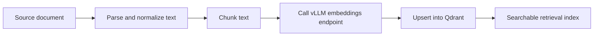

# Knowledge Ingestion Design

## Purpose

This document describes how source documents are transformed into searchable knowledge inside the retrieval platform.

The goal of this design is not to be perfect. The goal is to establish a strong, understandable baseline for a RAG-style system and document where it will fail.

## Design goals

The ingestion pipeline should:

- accept source documents in common text-friendly formats
- normalize text into consistent chunks
- generate embeddings for those chunks
- store vectors and useful payload metadata in Qdrant
- make new content searchable with minimal moving parts

## Baseline architecture

The ingestion workflow is implemented in the `api-go` codebase and runs as a dedicated ingestion mode or command rather than as part of the public request path.

That keeps public serving and bulk ingestion logically separate, even if they share the same codebase.

High-level flow:



## Source documents

In this project, source documents are assumed to be:

- Markdown
- plain text
- exported internal docs
- other text-centric formats that can be normalized before chunking

This is deliberate. The project is about retrieval platform design, not about building a full document-conversion pipeline.

## Parsing and normalization

Before chunking, the ingestion step should normalize the text.

Normalization goals:

- remove obvious formatting noise
- preserve meaningful headings
- preserve paragraph boundaries where possible
- attach source metadata such as document title or path
- avoid accidental chunk duplication caused by parser artifacts

Typical normalized fields:

- `doc_id`
- `source_path`
- `title`
- `section`
- `raw_text`
- `ingested_at`

## Chunking strategy

This baseline uses **fixed-size chunks with overlap**.

### Default chunk policy

- target chunk size: **600–800 characters**
- overlap: **100–150 characters**
- preserve heading boundaries where possible

This is a practical baseline because it balances:

- semantic density
- retrieval granularity
- enough local context for answer synthesis
- not exploding the number of points too aggressively

## Why this chunk size

Too-small chunks create these problems:

- lose context
- increase false positives
- inflate total point count
- make final answers more fragmented

Too-large chunks create these problems:

- mix unrelated ideas
- reduce retrieval precision
- waste context window space during final answer generation
- make debugging harder because one chunk may contain too much unrelated text

The chosen baseline is not “the best size.” It is the best **starting point** for a small, explainable retrieval system.

## Chunk identity

Each chunk should have a stable identifier derived from:

- document ID
- section or heading
- chunk index

Example:

```text
doc-architecture-overview::section-traffic-flow::chunk-03
```

Stable IDs matter for:

- repeat ingestion
- idempotent upserts
- easier debug traces
- future reindex strategies

## Embedding generation

For every chunk, the ingestion worker calls the `vLLM` embeddings endpoint and receives a dense vector.

`vLLM` provides an OpenAI-compatible server interface, which makes it straightforward for the API service to interact with it through standard HTTP semantics.

Key rule:

**The same embedding model family and vector dimension must be used consistently across the collection.**

If the query path and ingestion path disagree on model or dimension, retrieval breaks or silently degrades.

## Data stored in Qdrant

Each upserted point contains:

- vector embedding
- chunk text
- document metadata
- chunk metadata
- ingestion timestamp
- embedding model label

Example payload:

```json
{
  "doc_id": "architecture-overview",
  "title": "Architecture Overview",
  "section": "Traffic flows and trust boundaries",
  "chunk_id": "architecture-overview::traffic::chunk-02",
  "chunk_text": "api-go reaches vLLM over the network to a separate machine...",
  "source_path": "docs/architecture-overview.md",
  "embedding_model": "nomic-embed-text-v1",
  "ingested_at": "2026-03-18T10:00:00Z"
}
```

Qdrant collections store vectors and payloads together, which is a good fit for this style of retrieval application.

## Retrieval assumptions

At query time:

1. the user query is embedded using the same embedding model path
2. Qdrant returns top-k nearest chunks
3. `api-go` returns those chunks directly or passes them to generation

This is **baseline dense retrieval**, not a full production-grade ranking stack.

## Known limitations of baseline retrieval

This design is intentionally simple, so it has known weaknesses.

## 1. No reranking

Returned nearest neighbors may be semantically related but not the best final context.

Effect:

- more irrelevant chunks in top-k
- worse final answer quality
- lower precision on subtle queries

## 2. No hybrid lexical + semantic search

A purely dense embedding approach can miss exact keywords, error codes, IDs, or rare terms.

Effect:

- weak performance for identifier-heavy documents
- worse performance on highly literal search queries

## 3. No dedicated ingestion queue

If ingestion is implemented too simply, large imports can be harder to observe and recover.

Effect:

- backlog visibility may be weak
- retry semantics may be too coarse

## 4. Chunking is heuristic

Chunk size and overlap are engineering choices, not truths.

Effect:

- retrieval quality depends heavily on document style
- some docs want bigger chunks, some want smaller

## 5. No document versioning strategy yet

Re-ingesting changed docs may overwrite chunks cleanly if IDs are stable, but there is not yet a full lineage model.

Effect:

- diff-aware reindexing is still basic
- debugging historical search behavior is limited

## Failure modes to expect

## If vLLM is down

- embeddings cannot be generated
- ingestion stalls
- freshness degrades

## If Qdrant is down

- upserts fail
- retrieval fails
- ingestion may partially process but not persist results

## If chunking is poor

- retrieval returns vague or fragmented results
- answer generation hallucinates more often because context is weak

## If model changes without reindex

- vectors become inconsistent
- retrieval quality degrades sharply or requests fail due to dimension mismatch

## Why retrieval may still make mistakes

Even when the system is healthy, baseline retrieval can fail because:

- the best chunk was split badly
- the query phrasing does not align well with chunk embeddings
- dense search pulled a semantically adjacent but wrong section
- the relevant fact is spread across multiple chunks
- exact identifier lookup is weak without lexical search

This is normal. The important thing is to know **why** it fails, not to pretend it never will.

## Quality improvement roadmap

The most useful next improvements are:

1. **Reranker**
   - improve precision in top-k
2. **Hybrid search**
   - combine lexical and dense retrieval
3. **Document-aware chunking**
   - split by heading and semantic boundaries more intelligently
4. **Offline evaluation set**
   - fixed query/document pairs to track retrieval quality over time
5. **Stronger ingestion metrics**
   - backlog age, success rate, and per-stage latency

## Final rationale

This ingestion design is intentionally modest, but it is a solid baseline because it is:

- understandable
- easy to operate
- easy to explain
- realistic enough to show failure modes and future improvements

That is the right level for this project.
