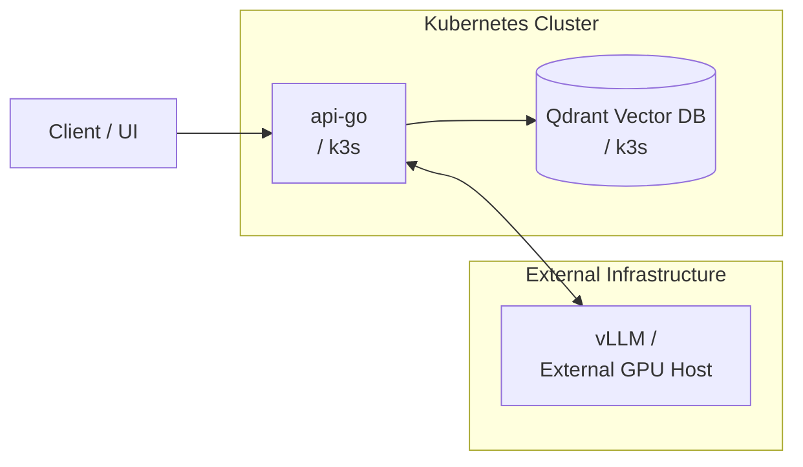

# Platform Architecture & RAG Implementation

This document outlines the system architecture of the AI Inference Platform. The design prioritizes operational simplicity, cost-efficiency, and strict separation of concerns between the stateless control plane and stateful inference/storage layers.

## 1. High-Level Architecture

The infrastructure is divided into two primary execution environments: a lightweight Kubernetes (k3s) cluster for the API and storage layers, and a dedicated external GPU host for heavy model inference.

## 2. Core Components

* **api-go (Stateless):** Written in Go 1.24. Serves as the primary ingress point. It orchestrates document chunking, coordinates embedding generation, and handles the RAG (Retrieval-Augmented Generation) logic.
* **Qdrant (Stateful):** A high-performance vector database deployed as a Kubernetes StatefulSet. It stores document embeddings along with their textual payloads and metadata for fast similarity search.
* **vLLM (External GPU Host):** A high-throughput and memory-efficient LLM serving engine. It provides an OpenAI-compatible HTTP interface for embedding generation and inference.

## 3. Retrieval-Augmented Generation (RAG) Pipeline

The platform implements a dense retrieval pipeline divided into two distinct workflows: Ingestion and Querying.

### A. Knowledge Ingestion Path

1. **Normalization & Chunking:** Source documents are parsed and split using a sliding window algorithm (target size: 800 characters, overlap: 120 characters) to preserve semantic context across chunk boundaries.
2. **Embedding Generation:** The API dispatches chunks to the external `vLLM` endpoint to generate dense vector embeddings.
3. **Upsertion:** Vectors, alongside their raw text and source metadata, are upserted into Qdrant using stable, deterministic IDs (e.g., `doc_id::chunk_index`).

### B. Retrieval Path

1. The client submits a natural language query.
2. `api-go` requests a query embedding from the `vLLM` service.
3. The dense vector is sent to Qdrant to perform a similarity search (using Cosine distance) against the indexed knowledge base.
4. Qdrant returns the top-K chunks, which are then passed to the LLM as context for final answer synthesis.

## 4. Key Architectural Decisions & Trade-offs

Engineering is about trade-offs. The following decisions were made to balance complexity, cost, and observability:

* **ADR-001: Qdrant over Managed Vector DBs (e.g., Pinecone)**
  *Rationale:* While managed services are faster to bootstrap, self-hosting Qdrant explicitly demonstrates stateful infrastructure ownership, Persistent Volume (PVC) management, and disaster recovery processes within Kubernetes.
  
* **ADR-002: External GPU Host over In-Cluster GPU Nodes**
  *Rationale:* GPU instances are expensive and introduce operational complexity (drivers, node taints, scheduling bugs). Running vLLM externally isolates the GPU failure domain, keeps the k3s cluster lightweight, and allows for rapid, cost-effective iteration on rented hardware without modifying the Kubernetes control plane.