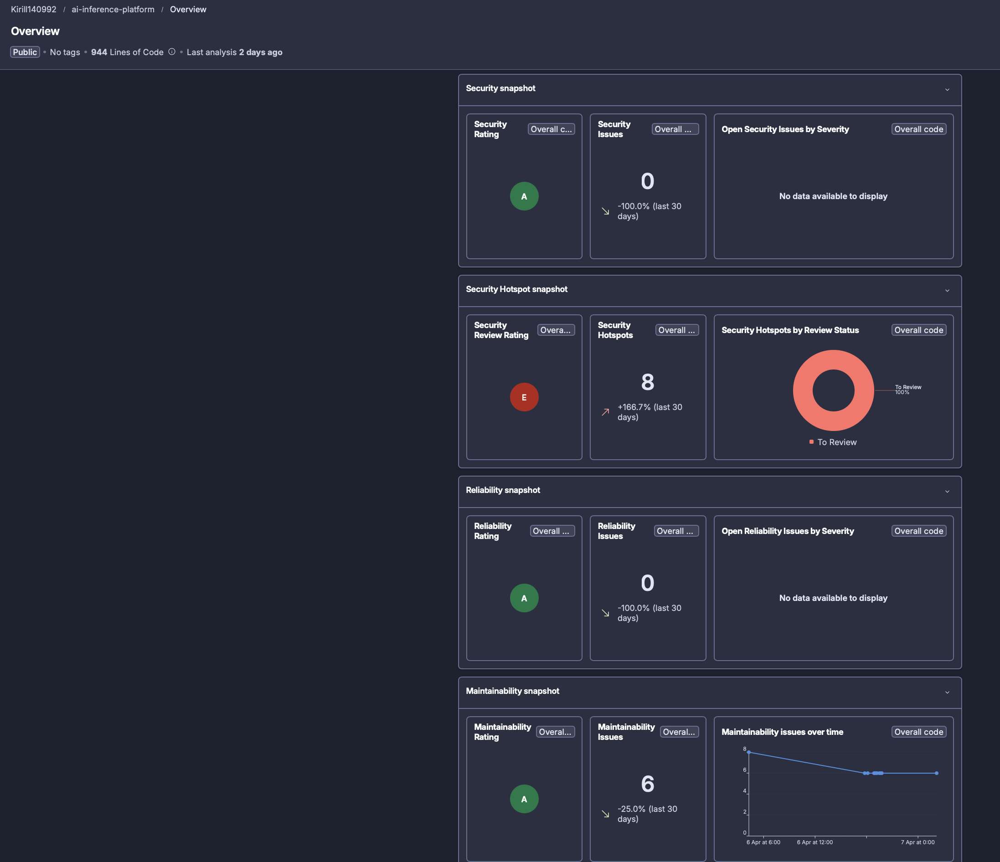
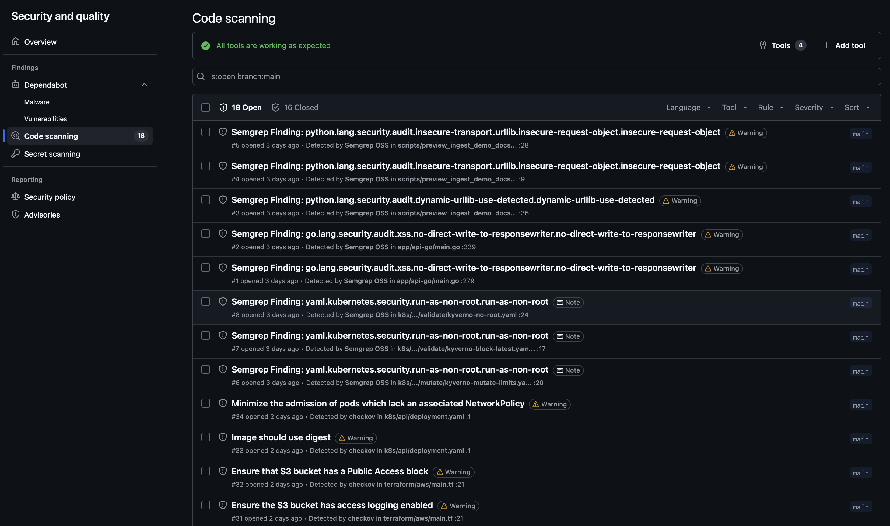
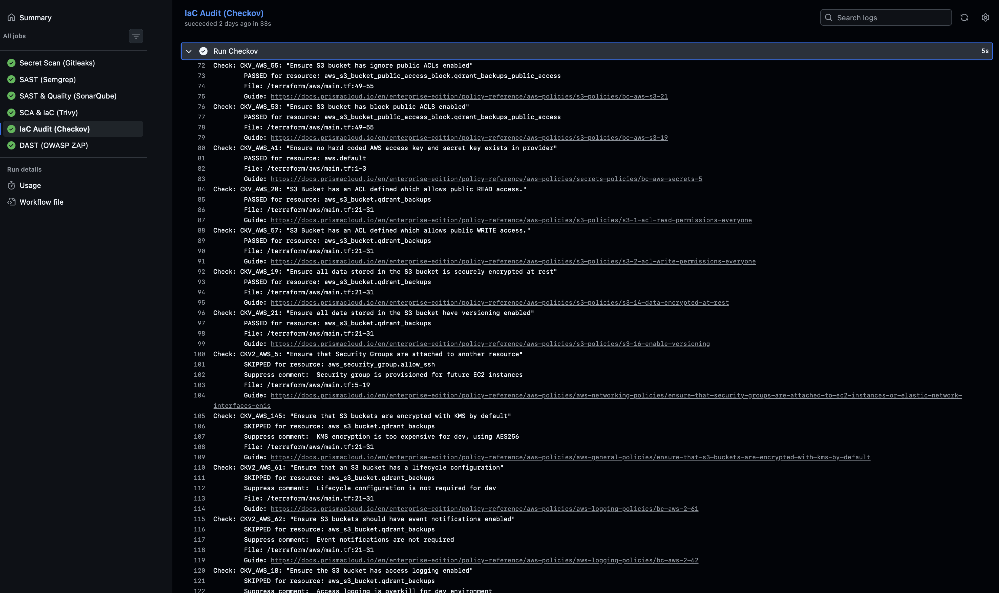
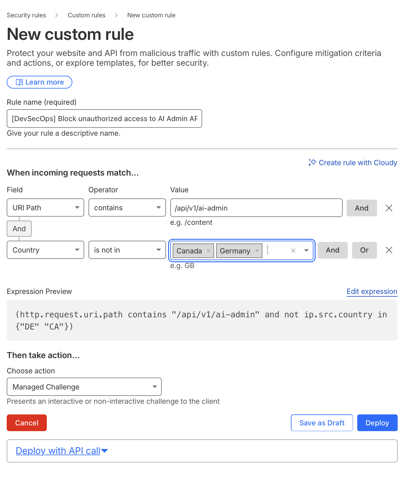
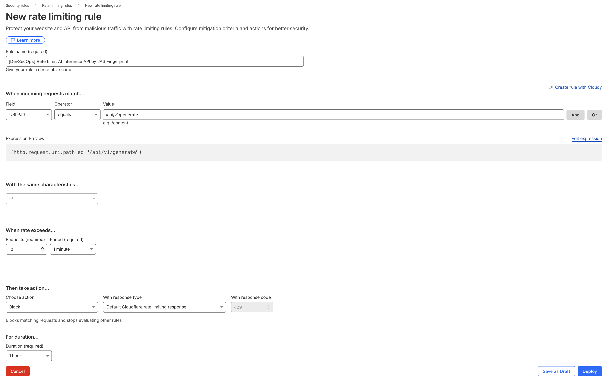
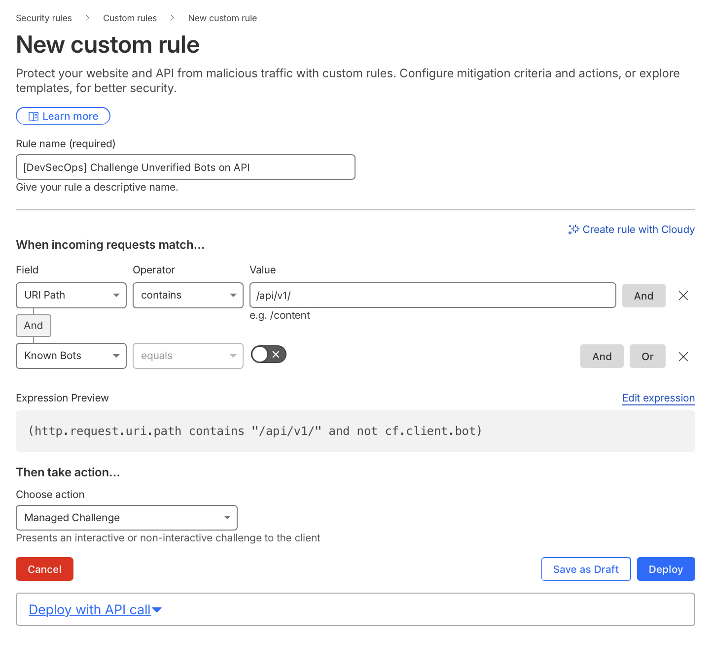

# 🛡️ Security Architecture & DevSecOps

The platform's security posture is built on the **Defense in Depth** paradigm. Security is embedded across three critical layers: at the code integration phase (Shift-Left CI/CD), during infrastructure deployment (IaC & Kubernetes Hardening), and at the network perimeter (Edge Security).

---

## 1. CI/CD & Shift-Left Security

The GitHub Actions pipeline is configured in strict **Enforcing Mode**. Any commit introducing vulnerabilities, secrets, or failing quality gates will automatically block the deployment process.

* **Secret Management:** `Gitleaks` continuously scans for hardcoded tokens. All operational secrets are encrypted at rest within the repository using `SOPS` and `age` asymmetric cryptography, ensuring 100% GitOps compliance.
* **SCA & Container Security:** `Trivy` analyzes the Docker base images (utilizing `scratch` to minimize the attack surface) and Go application dependencies (`go.mod`) for known CVEs.
* **Continuous Code Quality (SAST):** **SonarQube Cloud** is integrated to enforce strict Quality Gates. Pull Requests are blocked if new Security Hotspots are introduced or if code coverage drops below established thresholds.
* **Single Pane of Glass (Vulnerability Management):** All security scanners (including Checkov and Semgrep) are configured to generate standardized `.sarif` reports. These are automatically ingested into the **GitHub Advanced Security Dashboard**, creating a unified interface for vulnerability Triage and Technical Debt management.

---

## 2. Infrastructure & Kubernetes Hardening

All infrastructure is defined as code (Terraform and Kubernetes manifests) and statically analyzed using `Checkov` prior to provisioning.

* **Cloud Security (AWS):** S3 buckets for vector database backups enforce server-side encryption (AES-256) and versioning to mitigate ransomware risks. Strict `Public Access Blocks` are enabled. Network Security Groups restrict SSH access exclusively to the corporate VPN (Zero Trust).
* **Security as Code (Risk Acceptance):** Scanner exceptions (False Positives or accepted business risks) are managed via explicit **code annotations** rather than UI buttons. This ensures every exception requires a documented business justification and is tracked via Git history.
* **Kubernetes Security:**
  * Containers are strictly prohibited from running as `root` (`USER 10001` enforced in Dockerfiles).
  * Pods run with read-only filesystems and dropped capabilities where applicable.
  * Network Policies isolate namespace traffic.

---

## 3. Edge Security & Threat Mitigation (Cloudflare)

To prevent malicious traffic, automated scrapers, and L7 DDoS attacks from exhausting expensive GPU compute and Kubernetes resources, a multi-layered filtering architecture is implemented at the Cloudflare Edge.

### A. Virtual Patching & Geo-Fencing (WAF)
Critical administrative endpoints (e.g., `/api/v1/ai-admin`) are geofenced to restrict access only to operational regions. This drastically reduces the attack surface and allows for immediate "Virtual Patching" via WAF rules if a 0-day vulnerability is disclosed.

### B. Anti-DDoS & Advanced Rate Limiting
Resource-intensive AI inference APIs (`/api/v1/generate`) are strictly rate-limited (e.g., 10 requests/minute).
> *Architecture Note: In an Enterprise deployment, Rate Limiting is extended to group requests by **JA3 Fingerprints** alongside IPs, effectively neutralizing attacks from botnets utilizing rotating proxy pools.*

### C. Machine Learning Bot Management
To protect the Qdrant vector database from automated data scraping, Cloudflare's Machine Learning Bot Management is utilized. Traffic exhibiting anomalous, non-human patterns (Bot Score < 30) is not hard-blocked but served a `Managed Challenge` (CAPTCHA/JS Challenge), ensuring zero false positives for legitimate users.

